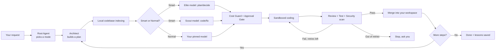

<div align="center">

# 🦈 DarkShark

**A local-first, multi-agent coding orchestrator for Windows.**
Bring your own AI — DarkShark handles planning, cost control, sandboxing, and safety.

[English](README.md) · [Tiếng Việt](VN_README.md)

[](LICENSE)
[]()
[]()

</div>

---

## What is DarkShark?

DarkShark is a desktop application (single installer, no Docker/Postgres/Node/Python required) that
orchestrates multiple AI agents to plan, write, review, test, and secure code — running on your own
machine, talking directly to the AI provider(s) **you** choose.

DarkShark does not sell AI usage. You connect your own API keys (Anthropic, OpenAI, or any
OpenAI-compatible endpoint — including self-hosted or third-party models), or use a free trial
connection to get started instantly. Every request goes straight from your machine to your chosen
provider; DarkShark itself does not act as a proxy or log request content.

> Built for ordinary hardware: 4 CPU cores / 8GB RAM / no dedicated GPU required.
> App startup under 5 seconds, idle RAM under 300MB.

---

## Table of Contents

- [Key Features](#key-features)
- [Conversation-first interface](#conversation-first-interface)
- [Model Servers — connect any provider, any model](#model-servers--connect-any-provider-any-model)
- [Smart vs Normal mode](#smart-vs-normal-mode)
- [Try it free with Puter (no key required)](#try-it-free-with-puter-no-key-required)
- [How it works (overview)](#how-it-works-overview)
- [System Requirements](#system-requirements)
- [Installation](#installation)
- [Quick Start](#quick-start)
- [Configuration](#configuration)
- [Architecture & Safety](#architecture--safety)
- [Security & Privacy](#security--privacy)
- [FAQ](#faq)
- [Contributing](#contributing)
- [License](#license)

---

## Key Features

- 💬 **Conversation-first UI** — no diagrams to learn. Talk to DarkShark like you would any chat
  assistant; plans, diffs, and progress show up inline or in a side panel.
- 🧩 **Task Graph under the hood** — every request is broken into dependent, trackable steps, run in
  parallel where possible.
- 🗺️ **Local codebase indexing (Graphify)** — maps your codebase locally (no AI tokens spent) so
  agents get the right context before touching anything.
- 🔌 **Model Servers** — connect as many AI providers as you want, and type in *any* model ID by
  hand (e.g. `deepseek-v4-pro`), not just a fixed dropdown list. Context window and pricing are
  auto-detected whenever possible.
- ⚡ **Smart / Normal mode** — Smart automatically routes planning and safety-critical decisions to a
  stronger (Elite) model and routine coding/fixing work to a lighter (Scout) model to cut cost;
  Normal pins one model for everything. Chosen right from the chat input, per conversation.
- 💰 **Cost Guard** — estimates and blocks spend **before** calling any AI, with a mid-stream kill
  switch if actual cost runs away from the estimate.
- 🔒 **Approval Gate** — pauses and asks for your confirmation before touching sensitive areas
  (payments, auth, migrations).
- 🛡️ **Sandboxed execution** — every coding subagent runs in an isolated Windows Job
  Object/AppContainer with resource limits and an OS-level network allowlist.
- 🔁 **Two-tier circuit breakers** — independent retry limits for review and testing, so a stuck agent
  can't loop forever and burn your budget.
- 📜 **Immutable audit log** — every spend, merge, rollback, and emergency stop is permanently
  recorded and cannot be edited or deleted, even by DarkShark itself.
- ♻️ **Crash recovery** — if the app closes unexpectedly mid-task, it resumes cleanly on next launch
  instead of losing your session.
- 🚫 **No fake data, ever** — if nothing succeeded, DarkShark shows a clear error, never a fabricated
  "it worked" placeholder.

---

## Conversation-first interface

DarkShark's interface is deliberately familiar: a sidebar for conversation history and projects, a
chat transcript in the middle, and a collapsible side panel for diffs and implementation plans —
similar to tools like Google Antigravity. There is no separate "node graph" screen to learn; the
Architect agent's plan is presented as a readable document (goals, open questions, review-required
callouts, step list) right inside the panel.

---

## Model Servers — connect any provider, any model

Instead of being locked to two hardcoded providers, DarkShark lets you add multiple **Model
Servers**, each with:

- A display name you choose (e.g. "Claude main", "Cheap DeepSeek")
- A provider type: Anthropic, OpenAI, or **Custom (any OpenAI-compatible endpoint)**
- A **free-text Model ID** field — type any model string, no fixed list to fall out of date
- Auto-detected context window and pricing whenever DarkShark recognizes the model or the endpoint
  exposes model metadata; manual override is always available, with a clear warning when pricing is
  unverified

You can assign one Model Server to the **Elite** role (planning/decisions) and another to **Scout**
(execution) for Smart Mode, or just pick one directly for a conversation.

---

## Smart vs Normal mode

Chosen from a single chip at the bottom of the chat input — no separate toggle elsewhere:

- **⚡ Smart** — planning, dispatch decisions, security review, and knowledge distillation always run
  on your assigned Elite model; coding, review, integration, and QA run on your assigned Scout model.
  If a Scout attempt fails and needs a retry, DarkShark automatically escalates that retry to Elite.
  Security review and planning are never downgraded, even if you tune the mapping.
- **◻ Normal** — pins one Model Server for the entire conversation, no tiering.

---

## Try it free with Puter (no key required)

For a **quick first taste** without creating any provider account, DarkShark can connect through
[Puter.js](https://puter.com), which lets you access several AI models (including Gemini) by
signing in with a free Puter account instead of an API key.

**Be aware**: Puter's free monthly allowance is small (well under $1 of usage) and is meant for a
quick trial, not sustained use — it will run out quickly on real coding tasks. DarkShark clearly
labels this option as a trial connection, not a substitute for your own API key, and will show a
clear error (never fake success) if the allowance runs out mid-task.

---

## How it works (overview)



Full technical diagram (every node, every branch): [`docs/DarkShark_WorkFlow_Map_v2.mermaid`](docs/DarkShark_WorkFlow_Map_v2.mermaid).

---

## System Requirements

| | Minimum |
|---|---|
| OS | Windows 10 / 11 (64-bit) |
| CPU | 4 cores |
| RAM | 8GB (idle app usage < 300MB) |
| GPU | Not required |
| Network | Only needed when actually calling an AI model — everything else works offline |
| Provider | Anthropic and/or OpenAI-compatible API key, **or** a free Puter account for a quick trial |

---

## Installation

1. Download `DarkShark-Setup.exe` from the **Releases** page.
2. Run the installer — no need to install Go/Node/Python/Docker separately.
3. Open DarkShark and follow the onboarding screen to add a Model Server (your own API key, a
   custom endpoint, or the Puter trial connection).

---

## Quick Start

1. Open DarkShark and describe what you want in plain language.
2. Review the **Cost/Time Preview** before anything runs.
3. Confirm the **Approval Gate** if your request touches a sensitive area.
4. Watch progress inline in the chat, with an 🧠/⚙️ badge showing which model tier handled each step.
5. Review the diff before DarkShark merges it into your real codebase.

---

## Configuration

Model Servers, budgets, and permissions are managed from **Settings** in the app. Example of what's
stored under the hood (`config.yaml`):

```yaml
smart_mode: true
default_model_tier: elite
auto_escalate_tier_on_retry: true
session_budget_cap_usd: 5.00
max_concurrent_subagents: 2
review_max_retries: 2
test_max_retries: 3
sensitive_paths:
  - "*/payment/*"
  - "*/auth/*"
  - "*/migration/*"
low_spec_mode: auto
```

Model Server entries (provider, base URL, model ID, pricing) are stored separately in the local
database; API keys are never stored in this file — see [Security & Privacy](#security--privacy).

---

## Architecture & Safety

- **Orchestrator core**: Go (native binary, no separate runtime to install).
- **App shell**: Tauri 2.0 (Rust + the WebView2 already on Windows 10/11).
- **Storage**: SQLite (WAL mode) — a single local `.db` file, no external server.
- **Subagent isolation**: Windows Job Object + AppContainer/Restricted Token — resource limits,
  filesystem isolation, and an OS-level network allowlist (not just an in-app check).
- **Audit log**: append-only via a SQLite trigger — no internal API can edit or delete it.

Full technical build/architecture reference: [`docs/DarkShark_CodeX_Build_Prompt_v2.md`](docs/DarkShark_CodeX_Build_Prompt_v2.md).

---

## Security & Privacy

- API keys are **never** stored in plaintext — encrypted via Windows Credential Manager (DPAPI).
- DarkShark has no middle server of its own and does not log the content of your requests to your
  chosen AI provider.
- If you choose the Puter trial connection, be aware that requests go through Puter's own
  infrastructure before reaching the underlying model — this is clearly labeled in the app, unlike
  your own direct BYOK connections.
- All displayed cost figures are **estimates**; your actual bill comes directly from your provider
  (Anthropic, OpenAI, Puter, etc.) — DarkShark does not charge for AI usage.
- The local telemetry WebSocket (`127.0.0.1`) requires a per-session token; no other process on your
  machine can read it.

---

## FAQ

**Does DarkShark send my code anywhere besides my chosen AI provider?**
No. Requests go straight from your machine to the provider you configured, using your own
credentials.

**Do I pay DarkShark a monthly fee?**
DarkShark sells the software itself. AI usage cost is your own arrangement with your provider(s),
not billed through DarkShark.

**What happens if my connection drops mid-task?**
Non-AI steps (linting, running tests, security scanning) keep working offline. Steps needing AI
pause until connectivity returns, and are clearly marked — never silently faked.

**What if the app closes unexpectedly?**
On next launch, DarkShark detects any interrupted task and safely requeues it — you won't lose your
session.

---

## Contributing

DarkShark is under active development. Please read the technical docs in `docs/` before opening a
PR, to keep changes consistent with the existing architecture (Handoff vs Task Dispatch, circuit
breakers, sandboxing, Model Server routing).

## License

DarkShark is licensed under the **GNU Affero General Public License v3.0 (AGPL-3.0)**. See
[`LICENSE`](LICENSE) for the full text.

In short: you're free to use, study, modify, and redistribute DarkShark. If you modify it and make
that modified version available to others over a network (including as a hosted service), you must
also make your modified source code available to those users under the same license. This keeps
DarkShark and any derivative of it open for everyone.

---

<div align="center">
<sub>DarkShark is not affiliated with or endorsed by Anthropic, OpenAI, Google, or Puter Technologies Inc.</sub>
</div>
