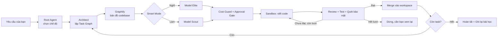

<div align="center">

# 🦈 DarkShark

**Multi-agent coding orchestrator chạy ngay trên máy Windows của bạn.**
Bạn mang API key riêng (BYOK) — DarkShark chỉ lo phần điều phối, kiểm soát chi phí và an toàn.

[]()
[]()
[]()

</div>

---

## DarkShark là gì?

DarkShark là một ứng dụng desktop (`.exe`, cài đặt một lần, không cần Docker/Postgres/Node/Python)
điều phối nhiều AI-agent để tự động lập trình — lập kế hoạch, viết code, tự review, tự chạy test, tự
rà bảo mật — trên chính máy tính của bạn.

DarkShark **không bán quyền dùng AI**. Bạn tự thêm API key của Anthropic hoặc OpenAI (mô hình
Bring-Your-Own-Key), và mọi request gọi thẳng từ máy bạn tới nhà cung cấp AI bằng key của chính bạn.
DarkShark không proxy, không log nội dung, không thu phí AI.

> Thiết kế nhắm tới máy cấu hình phổ thông: 4 nhân CPU / 8GB RAM / không cần GPU rời.
> Khởi động ứng dụng dưới 5 giây, RAM chờ (idle) dưới 300MB.

---

## Mục lục

- [Tính năng chính](#tính-năng-chính)
- [Smart Mode — phân tầng model để giảm chi phí](#smart-mode--phân-tầng-model-để-giảm-chi-phí)
- [Cách hoạt động (tổng quan)](#cách-hoạt-động-tổng-quan)
- [Yêu cầu hệ thống](#yêu-cầu-hệ-thống)
- [Cài đặt](#cài-đặt)
- [Bắt đầu nhanh](#bắt-đầu-nhanh)
- [Cấu hình (`config.yaml`)](#cấu-hình-configyaml)
- [Kiến trúc & an toàn](#kiến-trúc--an-toàn)
- [Bảo mật & quyền riêng tư](#bảo-mật--quyền-riêng-tư)
- [Câu hỏi thường gặp](#câu-hỏi-thường-gặp)
- [Đóng góp](#đóng-góp)
- [Giấy phép](#giấy-phép)

---

## Tính năng chính

- 🧭 **3 chế độ thực thi** — Planning (việc nhiều bước), Fast (việc đơn giản), Amend (chỉ sửa phần
  sai của lần chạy trước, không làm lại từ đầu).
- 🧩 **Task Graph** — chia yêu cầu lớn thành các task nhỏ có phụ thuộc rõ ràng, chạy song song khi
  độc lập với nhau.
- 🗺️ **Graphify** — tự lập bản đồ codebase (tree-sitter, chạy cục bộ, không tốn token AI) để agent
  hiểu đúng ngữ cảnh trước khi sửa.
- 💰 **Cost Guard** — ước tính & chặn chi phí **trước khi** gọi AI, có phanh khẩn cấp nếu chi phí
  thực tế vượt xa ước tính giữa chừng.
- 🔒 **Approval Gate** — tự dừng, xin xác nhận của bạn khi việc đụng tới vùng nhạy cảm (thanh toán,
  đăng nhập, migration).
- 🛡️ **Sandbox isolation** — mỗi Subagent chạy trong Windows Job Object + AppContainer riêng, giới
  hạn CPU/RAM, chặn truy cập mạng ngoài whitelist ở tầng hệ điều hành.
- 🔁 **Circuit Breaker 2 tầng** — giới hạn số lần retry độc lập cho Review và Test, tránh AI lặp vô
  tận gây tốn tiền.
- 📜 **Audit Log bất biến** — mọi hành động quan trọng (chi tiền, merge, rollback, dừng khẩn cấp)
  được ghi lại vĩnh viễn, không sửa/xoá được kể cả bởi chính hệ thống.
- 🧠 **Knowledge distillation** — sau mỗi phiên, chắt lọc bài học quan trọng, chỉ "quên" chi tiết
  nháp sau khi đã ghi lại điều cần nhớ.
- ♻️ **Tự phục hồi sau crash** — nếu app tắt đột ngột giữa chừng, lần mở lại tự đưa việc dang dở về
  hàng chờ thay vì mất session.
- 🖥️ **Low-Spec Mode** — tự giảm số Subagent chạy song song khi RAM khả dụng thấp, tránh treo máy.
- 🌐 **Offline-first** — chỉ cần mạng khi thật sự gọi AI; linter, test runner, quét bảo mật vẫn chạy
  được khi mất mạng.

---

## Smart Mode — phân tầng model để giảm chi phí

Phần lớn chi phí không nằm ở bước *lên kế hoạch* mà nằm ở bước *viết code / sửa lỗi lặp lại*. Khi bật
**⚡ Smart Mode**, DarkShark tách 2 vai trò và giao cho 2 tier model khác nhau:

| Vai trò | Việc cụ thể | Model tier |
|---|---|---|
| 🧠 **Nghĩ** | Chọn chiến lược, lập kế hoạch, duyệt yêu cầu chuyển việc, rà bảo mật, chắt lọc tri thức | **Elite** (mạnh, đắt) |
| ⚙️ **Làm** | Viết code, sửa lỗi, debug, chạy & báo cáo test, dọn code | **Scout** (nhẹ, rẻ) |

Nếu một task ở tier Scout thất bại và cần thử lại, DarkShark **tự động nâng lên Elite** cho lần thử
kế tiếp — vừa tiết kiệm ở phần lớn trường hợp, vừa không để AI yếu lặp sai mãi. Vai trò **lập kế
hoạch và rà bảo mật luôn khoá cứng ở Elite**, không bị hạ xuống dù bạn tuỳ chỉnh cấu hình — vì đây là
2 bước không nên đánh đổi để tiết kiệm.

---

## Cách hoạt động (tổng quan)



Sơ đồ kỹ thuật đầy đủ (mọi nhánh, mọi Node ID): xem [`docs/DarkShark_WorkFlow_Map_v2.mermaid`](docs/DarkShark_WorkFlow_Map_v2.mermaid).

---

## Yêu cầu hệ thống

| | Tối thiểu |
|---|---|
| Hệ điều hành | Windows 10 / 11 (64-bit) |
| CPU | 4 nhân |
| RAM | 8GB (app chờ dùng < 300MB) |
| GPU | Không bắt buộc |
| Mạng | Chỉ cần khi gọi AI — các bước khác chạy được offline |
| API key | Anthropic **hoặc** OpenAI (tự đăng ký, tự quản lý) |

---

## Cài đặt

1. Tải `DarkShark-Setup.exe` từ mục **Releases**.
2. Chạy file cài đặt — không cần cài thêm Go/Node/Python/Docker.
3. Mở DarkShark, làm theo màn hình hướng dẫn để thêm API key (được mã hoá bằng Windows Credential
   Manager, không lưu dạng chữ thường ở bất kỳ đâu trên máy).

---

## Bắt đầu nhanh

1. Mở DarkShark → nhập yêu cầu bằng ngôn ngữ tự nhiên (vd: *"Thêm chức năng quên mật khẩu cho trang
   đăng nhập"*).
2. Xem **Cost/Time Preview** — số tiền & thời gian ước tính trước khi chạy.
3. Nếu việc chạm vùng nhạy cảm, xác nhận ở **Approval Gate**.
4. Theo dõi tiến độ trực quan trên **Task Graph Canvas**, mỗi node có badge 🧠/⚙️ cho biết đang dùng
   model tier nào.
5. Xong việc, xem **Diff** trước khi để DarkShark merge vào codebase thật.

---

## Cấu hình (`config.yaml`)

```yaml
smart_mode: true
default_model_tier: elite
auto_escalate_tier_on_retry: true
session_budget_cap_usd: 5.00
max_concurrent_subagents: 2
review_max_retries: 2
test_max_retries: 3
sensitive_paths:
  - "*/payment/*"
  - "*/auth/*"
  - "*/migration/*"
allowed_domains:
  - api.anthropic.com
  - api.openai.com
low_spec_mode: auto
```

Toàn bộ danh sách tuỳ chọn: xem [`docs/DarkShark_CodeX_Build_Prompt_v2.md`](docs/DarkShark_CodeX_Build_Prompt_v2.md), mục 8.

---

## Kiến trúc & an toàn

- **Orchestrator core**: Go (binary native, không cần runtime cài thêm).
- **Vỏ ứng dụng**: Tauri 2.0 (Rust + WebView2 có sẵn trên Windows 10/11).
- **Lưu trữ**: SQLite (WAL mode) — 1 file `.db` cục bộ, không server ngoài.
- **Cách ly Subagent**: Windows Job Object + AppContainer/Restricted Token — giới hạn tài nguyên,
  cô lập filesystem, chặn mạng ngoài whitelist ở tầng hệ điều hành (không chỉ check trong code).
- **Audit Log**: append-only qua SQLite trigger — không API nội bộ nào sửa/xoá được.

Tài liệu kỹ thuật đầy đủ dành cho người muốn build/đóng góp: [`docs/DarkShark_CodeX_Build_Prompt_v2.md`](docs/DarkShark_CodeX_Build_Prompt_v2.md).

---

## Bảo mật & quyền riêng tư

- API key **không bao giờ** lưu dạng chữ thường — mã hoá qua Windows Credential Manager (DPAPI).
- DarkShark không có server trung gian, không log nội dung request gửi tới nhà cung cấp AI.
- Mọi số tiền hiển thị là **ước tính**; hoá đơn thật do Anthropic/OpenAI xuất trực tiếp cho tài khoản
  API của bạn — DarkShark không thu phí sử dụng AI.
- Kênh telemetry nội bộ (WebSocket `127.0.0.1`) yêu cầu token phiên, tiến trình khác trên máy không
  đọc được.

---

## Câu hỏi thường gặp

**DarkShark có gửi code của tôi cho ai khác ngoài Anthropic/OpenAI không?**
Không. Request đi thẳng từ máy bạn tới nhà cung cấp AI bằng key của chính bạn.

**Tôi cần trả phí DarkShark hàng tháng không?**
DarkShark bán phần mềm; chi phí AI là chi phí API riêng của bạn với Anthropic/OpenAI, không qua DarkShark.

**Mất mạng giữa chừng thì sao?**
Các bước không cần AI (lint, chạy test, quét bảo mật) vẫn chạy được. Bước cần gọi AI sẽ tạm dừng tới
khi có mạng lại.

**App bị tắt đột ngột giữa lúc đang chạy thì mất dữ liệu không?**
Không — lần mở lại, DarkShark tự phát hiện việc dang dở và đưa về hàng chờ để tiếp tục.

---

## Đóng góp

Đang trong giai đoạn phát triển. Issue/PR đóng góp vui lòng tham khảo tài liệu kỹ thuật trong
`docs/` trước khi gửi để đảm bảo đúng kiến trúc (Handoff vs Task Dispatch, Circuit Breaker, Sandbox...).

## Giấy phép

_(Cập nhật giấy phép chính thức tại đây trước khi public repo.)_

---

<div align="center">
<sub>DarkShark không thuộc sở hữu hay được tài trợ bởi Anthropic, OpenAI, hay Google.</sub>
</div>
