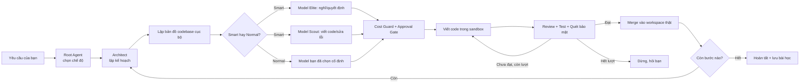

<div align="center">

# 🦈 DarkShark

**Trình điều phối lập trình đa AI-agent, chạy cục bộ trên Windows.**
Bạn tự mang AI riêng — DarkShark lo phần lập kế hoạch, kiểm soát chi phí, cách ly an toàn.

[English](README.md) · [Tiếng Việt](README.vi.md)

[](LICENSE)
[]()
[]()

</div>

---

## DarkShark là gì?

DarkShark là ứng dụng desktop (1 file cài đặt duy nhất, không cần Docker/Postgres/Node/Python) điều
phối nhiều AI-agent để lập kế hoạch, viết, review, test và rà bảo mật code — chạy ngay trên máy bạn,
gọi thẳng tới (những) nhà cung cấp AI **do chính bạn chọn**.

DarkShark không bán quyền dùng AI. Bạn tự kết nối API key riêng (Anthropic, OpenAI, hoặc bất kỳ
endpoint tương thích OpenAI nào — kể cả model tự host hay bên thứ ba), hoặc dùng kết nối dùng thử
miễn phí để trải nghiệm ngay. Mọi request đi thẳng từ máy bạn tới nhà cung cấp đã chọn; DarkShark
không đóng vai trò trung gian và không ghi log nội dung request.

> Thiết kế cho máy cấu hình phổ thông: 4 nhân CPU / 8GB RAM / không cần GPU rời.
> Khởi động dưới 5 giây, RAM chờ dưới 300MB.

---

## Mục lục

- [Tính năng chính](#tính-năng-chính)
- [Giao diện hội thoại](#giao-diện-hội-thoại)
- [Model Server — kết nối bất kỳ nhà cung cấp/model nào](#model-server--kết-nối-bất-kỳ-nhà-cung-cấpmodel-nào)
- [Chế độ Smart và Normal](#chế-độ-smart-và-normal)
- [Dùng thử miễn phí qua Puter (không cần key)](#dùng-thử-miễn-phí-qua-puter-không-cần-key)
- [Cách hoạt động (tổng quan)](#cách-hoạt-động-tổng-quan)
- [Yêu cầu hệ thống](#yêu-cầu-hệ-thống)
- [Cài đặt](#cài-đặt)
- [Bắt đầu nhanh](#bắt-đầu-nhanh)
- [Cấu hình](#cấu-hình)
- [Kiến trúc & an toàn](#kiến-trúc--an-toàn)
- [Bảo mật & quyền riêng tư](#bảo-mật--quyền-riêng-tư)
- [Câu hỏi thường gặp](#câu-hỏi-thường-gặp)
- [Đóng góp](#đóng-góp)
- [Giấy phép](#giấy-phép)

---

## Tính năng chính

- 💬 **Giao diện hội thoại** — không cần học sơ đồ gì cả. Trò chuyện với DarkShark như bất kỳ trợ lý
  chat nào; kế hoạch, diff, tiến độ hiện ngay trong luồng chat hoặc panel bên cạnh.
- 🧩 **Task Graph chạy ngầm** — mọi yêu cầu được chia thành các bước có phụ thuộc rõ ràng, chạy song
  song khi có thể.
- 🗺️ **Lập bản đồ codebase cục bộ (Graphify)** — quét codebase ngay trên máy (không tốn token AI) để
  agent hiểu đúng ngữ cảnh trước khi động vào bất cứ đâu.
- 🔌 **Model Server** — kết nối bao nhiêu nhà cung cấp AI tuỳ ý, gõ tay *bất kỳ* Model ID nào (vd
  `deepseek-v4-pro`), không giới hạn trong danh sách dựng sẵn. Context window và giá được tự động
  phát hiện khi có thể.
- ⚡ **Chế độ Smart / Normal** — Smart tự động giao việc lập kế hoạch và quyết định quan trọng cho
  model mạnh (Elite), việc viết code/sửa lỗi thường ngày cho model nhẹ (Scout) để giảm chi phí;
  Normal cố định 1 model cho mọi việc. Chọn ngay tại ô nhập chat, theo từng cuộc trò chuyện.
- 💰 **Cost Guard** — ước tính và chặn chi tiêu **trước khi** gọi AI, có phanh khẩn cấp giữa chừng nếu
  chi phí thực tế vượt xa ước tính.
- 🔒 **Approval Gate** — tạm dừng, xin xác nhận trước khi đụng tới vùng nhạy cảm (thanh toán, đăng
  nhập, migration).
- 🛡️ **Thực thi trong sandbox** — mỗi Subagent chạy trong Windows Job Object/AppContainer cách ly
  riêng, giới hạn tài nguyên, whitelist mạng ở tầng hệ điều hành.
- 🔁 **Circuit breaker 2 tầng** — giới hạn retry độc lập cho review và test, tránh agent lặp vô tận
  đốt hết ngân sách.
- 📜 **Audit log bất biến** — mọi khoản chi, merge, rollback, dừng khẩn cấp được ghi lại vĩnh viễn,
  không sửa/xoá được kể cả bởi chính DarkShark.
- ♻️ **Tự phục hồi sau crash** — app tắt đột ngột giữa chừng thì lần mở lại tự tiếp tục sạch sẽ, không
  mất phiên làm việc.
- 🚫 **Không bao giờ có dữ liệu ảo** — nếu chưa có gì thành công, DarkShark luôn hiện lỗi rõ ràng, không
  bao giờ hiện nội dung giả "đã xong".

---

## Giao diện hội thoại

Giao diện DarkShark cố tình thiết kế quen thuộc: sidebar cho lịch sử trò chuyện/dự án, luồng chat ở
giữa, panel bên cạnh thu gọn được cho diff và kế hoạch triển khai — gần giống các công cụ như Google
Antigravity. Không có màn hình "sơ đồ node" riêng biệt nào cần học; kế hoạch của Architect agent hiện
dạng tài liệu dễ đọc (mục tiêu, câu hỏi mở, phần cần xác nhận, danh sách bước) ngay trong panel.

---

## Model Server — kết nối bất kỳ nhà cung cấp/model nào

Thay vì bị khoá cứng 2 nhà cung cấp, DarkShark cho phép thêm nhiều **Model Server**, mỗi cái gồm:

- Tên hiển thị do bạn đặt (vd "Claude chính", "DeepSeek rẻ")
- Loại nhà cung cấp: Anthropic, OpenAI, hoặc **Tuỳ chỉnh (bất kỳ endpoint tương thích OpenAI nào)**
- Ô **Model ID nhập tay tự do** — gõ bất kỳ chuỗi model nào, không bị giới hạn bởi danh sách có thể
  lỗi thời
- Tự động phát hiện context window và giá khi DarkShark nhận diện được model hoặc endpoint có trả về
  metadata; luôn có thể ghi đè thủ công, kèm cảnh báo rõ khi giá chưa được xác minh

Bạn có thể gán 1 Model Server cho vai trò **Elite** (lập kế hoạch/quyết định) và 1 cái khác cho
**Scout** (thực thi) để dùng Smart Mode, hoặc chọn thẳng 1 model cho riêng 1 cuộc trò chuyện.

---

## Chế độ Smart và Normal

Chọn tại đúng 1 chip ở đáy ô nhập chat — không có toggle nào khác ở nơi khác:

- **⚡ Smart** — lập kế hoạch, quyết định chuyển việc, rà bảo mật, chắt lọc tri thức luôn chạy trên
  model Elite bạn đã gán; viết code, review, hợp nhất, test chạy trên model Scout bạn đã gán. Nếu 1
  lượt Scout thất bại cần thử lại, DarkShark tự động nâng lượt thử đó lên Elite. Rà bảo mật và lập kế
  hoạch không bao giờ bị hạ tier, kể cả khi bạn tự chỉnh cấu hình.
- **◻ Normal** — cố định 1 Model Server cho toàn bộ cuộc trò chuyện, không phân tầng.

---

## Dùng thử miễn phí qua Puter (không cần key)

Để **trải nghiệm nhanh lần đầu** mà không cần tạo tài khoản với bất kỳ nhà cung cấp nào, DarkShark có
thể kết nối qua [Puter.js](https://puter.com) — cho phép dùng thử vài model AI (kể cả Gemini) chỉ bằng
cách đăng nhập tài khoản Puter miễn phí thay vì API key.

**Lưu ý**: hạn mức miễn phí hàng tháng của Puter rất nhỏ (chưa tới $1 sử dụng) và chỉ phù hợp để dùng
thử nhanh, không dùng lâu dài được — sẽ hết rất nhanh với công việc coding thật. DarkShark ghi rõ đây
là kết nối dùng thử, không thay thế được API key riêng, và sẽ hiện lỗi rõ ràng (không bao giờ giả vờ
thành công) nếu hết hạn mức giữa chừng.

---

## Cách hoạt động (tổng quan)



Sơ đồ kỹ thuật đầy đủ (mọi node, mọi nhánh): [`docs/DarkShark_WorkFlow_Map_v2.mermaid`](docs/DarkShark_WorkFlow_Map_v2.mermaid).

---

## Yêu cầu hệ thống

| | Tối thiểu |
|---|---|
| Hệ điều hành | Windows 10 / 11 (64-bit) |
| CPU | 4 nhân |
| RAM | 8GB (app chờ dùng < 300MB) |
| GPU | Không bắt buộc |
| Mạng | Chỉ cần khi thật sự gọi AI — mọi thứ khác chạy được offline |
| Nhà cung cấp | API key Anthropic và/hoặc tương thích OpenAI, **hoặc** tài khoản Puter miễn phí để dùng thử nhanh |

---

## Cài đặt

1. Tải `DarkShark-Setup.exe` từ mục **Releases**.
2. Chạy file cài đặt — không cần cài thêm Go/Node/Python/Docker.
3. Mở DarkShark, làm theo màn hình onboarding để thêm 1 Model Server (API key riêng, endpoint tuỳ
   chỉnh, hoặc kết nối dùng thử Puter).

---

## Bắt đầu nhanh

1. Mở DarkShark, mô tả yêu cầu bằng ngôn ngữ tự nhiên.
2. Xem **Cost/Time Preview** trước khi chạy bất cứ gì.
3. Xác nhận ở **Approval Gate** nếu yêu cầu chạm vùng nhạy cảm.
4. Theo dõi tiến độ ngay trong luồng chat, badge 🧠/⚙️ cho biết tier model nào đang xử lý bước nào.
5. Xem diff trước khi DarkShark merge vào codebase thật.

---

## Cấu hình

Model Server, ngân sách, quyền hạn được quản lý trong **Cài đặt** của app. Ví dụ những gì được lưu ở
tầng dưới (`config.yaml`):

```yaml
smart_mode: true
default_model_tier: elite
auto_escalate_tier_on_retry: true
session_budget_cap_usd: 5.00
max_concurrent_subagents: 2
review_max_retries: 2
test_max_retries: 3
sensitive_paths:
  - "*/payment/*"
  - "*/auth/*"
  - "*/migration/*"
low_spec_mode: auto
```

Các Model Server (provider, base URL, model ID, giá) được lưu riêng trong database cục bộ; API key
không bao giờ nằm trong file này — xem [Bảo mật & quyền riêng tư](#bảo-mật--quyền-riêng-tư).

---

## Kiến trúc & an toàn

- **Orchestrator core**: Go (binary native, không cần cài thêm runtime).
- **Vỏ ứng dụng**: Tauri 2.0 (Rust + WebView2 có sẵn trên Windows 10/11).
- **Lưu trữ**: SQLite (WAL mode) — 1 file `.db` cục bộ duy nhất, không có server ngoài.
- **Cách ly Subagent**: Windows Job Object + AppContainer/Restricted Token — giới hạn tài nguyên, cô
  lập filesystem, whitelist mạng ở tầng hệ điều hành (không chỉ check trong app).
- **Audit log**: append-only qua SQLite trigger — không API nội bộ nào sửa/xoá được.

Tài liệu kỹ thuật đầy đủ: [`docs/DarkShark_CodeX_Build_Prompt_v2.md`](docs/DarkShark_CodeX_Build_Prompt_v2.md).

---

## Bảo mật & quyền riêng tư

- API key **không bao giờ** lưu dạng chữ thường — mã hoá qua Windows Credential Manager (DPAPI).
- DarkShark không có server trung gian riêng, không ghi log nội dung request gửi tới nhà cung cấp AI
  bạn chọn.
- Nếu chọn kết nối dùng thử Puter, lưu ý request sẽ đi qua hạ tầng của Puter trước khi tới model gốc —
  điều này được ghi rõ trong app, khác với kết nối BYOK trực tiếp của bạn.
- Mọi số tiền hiển thị đều là **ước tính**; hoá đơn thật đến trực tiếp từ nhà cung cấp của bạn
  (Anthropic, OpenAI, Puter...) — DarkShark không thu phí sử dụng AI.
- Kênh telemetry cục bộ (`127.0.0.1`) yêu cầu token theo phiên; tiến trình khác trên máy không đọc
  được.

---

## Câu hỏi thường gặp

**DarkShark có gửi code của tôi cho ai khác ngoài nhà cung cấp tôi chọn không?**
Không. Request đi thẳng từ máy bạn tới nhà cung cấp đã cấu hình, bằng credential của chính bạn.

**Tôi có phải trả phí hàng tháng cho DarkShark không?**
DarkShark bán phần mềm. Chi phí AI là thoả thuận riêng giữa bạn và nhà cung cấp, không qua DarkShark.

**Mất kết nối giữa chừng thì sao?**
Các bước không cần AI (lint, chạy test, quét bảo mật) vẫn chạy offline. Bước cần AI tạm dừng tới khi
có mạng lại, và luôn hiển thị rõ ràng — không bao giờ giả vờ đã xong.

**App tắt đột ngột thì sao?**
Lần mở lại, DarkShark tự phát hiện task bị gián đoạn và đưa về hàng chờ an toàn — không mất phiên làm
việc.

---

## Đóng góp

DarkShark đang trong giai đoạn phát triển tích cực. Vui lòng đọc tài liệu kỹ thuật trong `docs/`
trước khi gửi PR, để giữ thay đổi nhất quán với kiến trúc hiện có (Handoff vs Task Dispatch, circuit
breaker, sandbox, định tuyến Model Server).

## Giấy phép

DarkShark được cấp phép theo **GNU Affero General Public License v3.0 (AGPL-3.0)**. Xem toàn văn tại
[`LICENSE`](LICENSE).

Tóm tắt: bạn được tự do dùng, nghiên cứu, sửa đổi, phân phối lại DarkShark. Nếu bạn sửa đổi và cung
cấp bản sửa đổi đó cho người khác qua mạng (kể cả dưới dạng dịch vụ hosted), bạn **bắt buộc phải công
khai mã nguồn bản sửa đổi đó** theo cùng giấy phép. Điều này giữ cho DarkShark và mọi bản phái sinh
của nó luôn mở cho tất cả mọi người.

---

<div align="center">
<sub>DarkShark không thuộc sở hữu hay được tài trợ bởi Anthropic, OpenAI, Google, hay Puter Technologies Inc.</sub>
</div>
